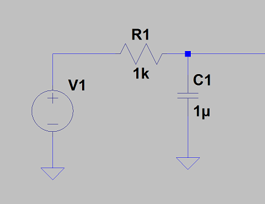
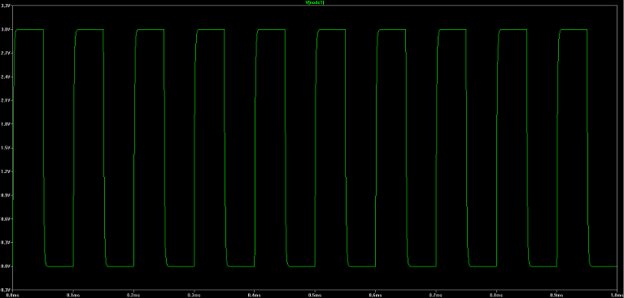
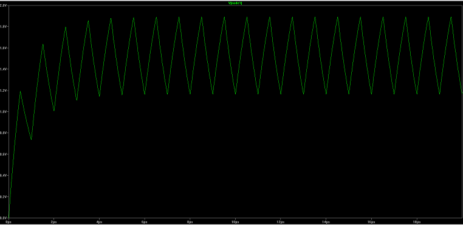

_Created: Aug, 2015_

I always find myself learning a lot from very simple and basic things. Take a circuit 101 level problem for example, in which a PWM wave excites a 1st-order low-pass RC network:

What are the maximum and minimum voltages from the output (voltage on the capacitor)? It is very obvious if the transition is slow enough, the max and min are very close to Vp (peak voltage of PWM) and 0. For example, if the PWM source has frequency of 10 kHz, duty cycle of 50% and peak voltage of 3V, the SPICE simulation gives

However, if the PWM becomes fast, the capacitor may not get fully charged before being discharged, and then get charged again before being fully discharged. The max and min voltages in steady state should be some values between Vp and 0. For example, if change the frequency of the same PWM above to 1 MHz, it will give 

It is easy to get max and min voltages from a SPICE simulation, which depend on PWM amplitude, frequency and duty cycle. But is there a simple analytical solution? It turns out to be yes. 

Going back to circuit 101, the output voltage Vc(t) of the RC network above can be solved from a simple 1st-order ordinary differential equation:

\[\frac{V_{in} - V_c(t)}{R} = C \frac{dV_c(t)}{dt}\]

The solution to this equation depends on the initial condition. If the input transitions from 0 to Vp at t=0, the solution is 

\[V_c(t) = V_p - (V_p - V_{c0})\exp(-\frac{t}{\tau})\]

where 

\[\tau = RC\]

and Vc0 is the initial voltage on capacitor at t=0. If the input transitions from Vp to 0 at t=0, the solution then becomes

\[V_c(t) = V_{c0}\exp(-\frac{t}{\tau})\]

In the steady state, the max and min voltage from the previous cycle should equal to those in the current cycle. Let's say the period and duty cycle of the PWM input are T and h. Assuming there is no initial charge on the capacitor, after the circuit reaches steady state, the relationships between Vmax and Vmin are

\[V_{max} = V_p - (V_p -V_{min}) \exp(-\frac{hT}{\tau})\]

in the charging stage, and 

\[V_{min} = V_{max} \exp(-\frac{(1-h)T}{\tau})\]

in the discharging stage. Obviously, Vmax and Vmin can be easily solved from those equations, which are

\[V_{max} = V_p \frac{1-\exp(-\frac{hT}{\tau})}{1 - \exp(-\frac{T}{\tau})}\]

\[V_{min} = V_p \frac{\exp(-\frac{(1-h)T}{\tau})-\exp(-\frac{T}{\tau})}{1 - \exp(-\frac{T}{\tau})}\]

