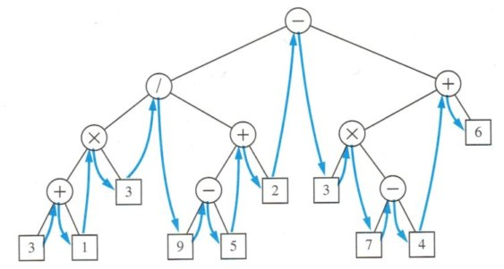

_Click [here](./index.html) to go back to LeetCode summary page._

Problem description is [here](https://oj.leetcode.com/problems/binary-tree-inorder-traversal/), or as follows: 

<pre>
Given a binary tree, return the inorder traversal of its nodes' values.

For example:
Given binary tree {1,#,2,3},

   1
    \
     2
    /
   3

return [1,3,2].

Note: Recursive solution is trivial, could you do it iteratively?
</pre>

* Solution 1: [Python](https://github.com/lijunhw/leetcode_practice/blob/master/binary_tree_inorder_traversal_medium/Solution1.py)
* Solution 2: [Python](https://github.com/lijunhw/leetcode_practice/blob/master/binary_tree_inorder_traversal_medium/Solution2.py)
* Solution 3: [Python](https://github.com/lijunhw/leetcode_practice/blob/master/binary_tree_inorder_traversal_medium/Solution3.py)

The definition of inorder traversal is illustrated as follows: 

Solution 1 is a recursive implementation and is trivial. The average space complexity is O(log(N)) (but the worst case can be O(N) if the tree is highly imbalanced). The run-time complexity is O(N) since every node is visted once. 

Solution 2 is essentially same to Solution 1 except it is an interactive implementation using a stack. It has same run-time and space complexity. Pay attention to the endpoint condition of the while loop (node is not None, __or__ stack is not empty). 

Solution 3 is a more advanced implementation called _Morris traversal_, which was discussed in [this post](Discussion can be found at http://blog.csdn.net/linhuanmars/article/details/20187257). The idea is to point the rightmost element of left subtree (previous adjacent element in the inorder traversal output) to the next tree node in the inorder output, so that the parent node can be accessed. When done, change the modified node back to its original value. No stack is involved in this implementation, and the space complexity is O(1)!

Solution 1 and Solution 2 should be memorized because they are among the most basic tree operations. 

Another important comment about the inorder traversal is that if it is a binary search tree, the inorder traversal output will be in ascending order. This can be an important attribute which is utilized in other tree problems (such as binary search tree generation from arrays). 

