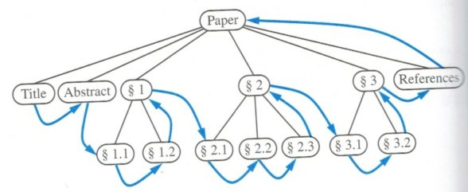

_Click [here](./index.html) to go back to LeetCode summary page._

Problem description is [here](https://oj.leetcode.com/problems/binary-tree-postorder-traversal/), or as follows: 

<pre>
Given a binary tree, return the postorder traversal of its nodes' values.

For example:
Given binary tree {1,#,2,3},
   1
    \
     2
    /
   3
return [3,2,1].

Note: Recursive solution is trivial, could you do it iteratively?
</pre>

* Solution 1: [Python](https://github.com/lijunhw/leetcode_practice/blob/master/binary_tree_postorder_traversal_medium/Solution1.py)
* Solution 2: [Python](https://github.com/lijunhw/leetcode_practice/blob/master/binary_tree_postorder_traversal_medium/Solution2.py)

The definition of postorder traversal is illustrated as follows: 

Comments on Solution 1, 2 are very similar to those in ["Binary Tree Inorder Traversal"](./binary_tree_inorder_traversal.html) problem. See how Solution 2 here is different from the Solution 2 of ["Binary Tree Inorder Traversal"](./binary_tree_inorder_traversal.html) and ["Binary Tree Preorder Traversal"](./binary_tree_preorder_traversal.html) problems. Note that this postorder iterative version is more complicated than preorder and inorder traversal. More delicate handling of stack is needed. Discussion can be found [here](http://blog.csdn.net/linhuanmars/article/details/22009351). 

Again, Solution 1 and 2 should be memorized. Morris traversal is not included here since it is a little complicated for postorder traversal. 

