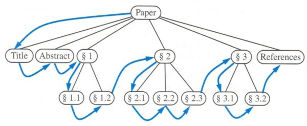

_Click [here](./index.html) to go back to LeetCode summary page._

Problem description is [here](https://oj.leetcode.com/problems/binary-tree-preorder-traversal/), or as follows: 

<pre>
Given a binary tree, return the preorder traversal of its nodes' values.

For example:
Given binary tree {1,#,2,3},
   1
    \
     2
    /
   3
return [1,2,3].

Note: Recursive solution is trivial, could you do it iteratively?
</pre>

* Solution 1: [Python](https://github.com/lijunhw/leetcode_practice/blob/master/binary_tree_preorder_traversal_medium/Solution1.py)
* Solution 2: [Python](https://github.com/lijunhw/leetcode_practice/blob/master/binary_tree_preorder_traversal_medium/Solution2.py)
* Solution 3: [Python](https://github.com/lijunhw/leetcode_practice/blob/master/binary_tree_preorder_traversal_medium/Solution3.py)

The definition of preorder traversal is illustrated as follows:

Comments on Solution 1, 2 and 3 are very similar to those in ["Binary Tree Inorder Traversal"](./binary_tree_inorder_traversal.html) problem. See how Solution 2 here is different from the Solution 2 of ["Binary Tree Inorder Traversal"](./binary_tree_inorder_traversal.html) and ["Binary Tree Postorder Traversal"](./binary_tree_postorder_traversal.html) problems. 

Again, Solution 1 and 2 should be memorized. 

