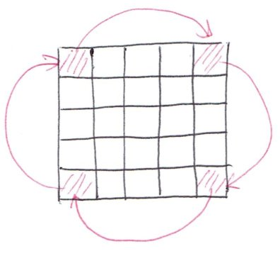

_Click [here](./index.html) to go back to LeetCode summary page._

Problem description is [here](https://oj.leetcode.com/problems/rotate-image/), or as follows: 

<pre>
You are given an n x n 2D matrix representing an image.

Rotate the image by 90 degrees (clockwise).

Follow up:
Could you do this in-place?
</pre>

* Solution 1: [Python](https://github.com/lijunhw/leetcode_practice/blob/master/rotate_image_medium/Solution1.py)

The idea behind this solution is similar to [Spiral Matrix I and II](./spiral_matrix_I_and_II.html) problem: going from the outer layer to inner layer. Here, the elements are rototated one by one. Again, one needs to figure out the index algebra, but that is more of details. It does not matter if the number of rows/columns is odd like in [Spiral Matrix I](./spiral_matrix_I_and_II.html) because the matrix is square and the center single element already takes care of itself if there is any. 
