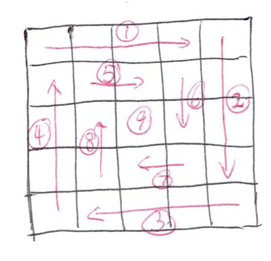

_Click [here](./index.html) to go back to LeetCode summary page._

Problem description is [here](https://oj.leetcode.com/problems/spiral-matrix/), or as follows: 

<pre>
Given a matrix of m x n elements (m rows, n columns), 
return all elements of the matrix in spiral order.

For example,
Given the following matrix:

[
 [ 1, 2, 3 ],
 [ 4, 5, 6 ],
 [ 7, 8, 9 ]
]

You should return [1,2,3,6,9,8,7,4,5]. 
</pre>

* Solution 1: [Python](https://github.com/lijunhw/leetcode_practice/blob/master/spiral_matrix_medium/Solution1.py)

The algorithm in the solution above can be illustrated below for the ease of understanding:

The idea is simple: divide each layer into four connected parts, and print them layer by layer. Extra care is needed when the number of layers is odd, and there will be some remaining elements unprinted by the end of the iteration. In this case, additional code is written to print them out. For example, the picture above illustrates the output sequence, as 1 --> 2 --> 3... --> 9. See the Python code above for details. 

The algorithm itself doesn't involve fancy algorithms and data structure, but the index manipulation can be tedious and error prone. 

The reverse problem of generating spiral matrix is [here](https://oj.leetcode.com/problems/spiral-matrix-ii/), or as follows:

<pre>
Given an integer n, generate a square matrix filled 
with elements from 1 to n2 in spiral order.

For example,
Given n = 3,
You should return the following matrix:

[
 [ 1, 2, 3 ],
 [ 8, 9, 4 ],
 [ 7, 6, 5 ]
]
</pre>

* Solution 1: [Python](https://github.com/lijunhw/leetcode_practice/blob/master/spiral_matrix_II_medium/Solution1.py)

Given we already know how to do the spiral matrix problem I, the algorithm of this problem is easy to think about: it is just the opposite of problem I, except it is even easier here since it is a square matrix. 
