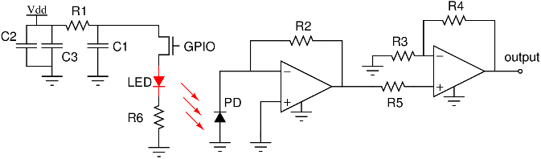

_First created: Jul, 2014 // Last updated: Jul, 2014_

A dust detector can be made from several off-the-shelf components. Why bother making my own dust detector when there are commercial ones such as [this Sharp dust sensor](http://www.ebay.com/sch/i.html?_trksid=p2050601.m570.l1313.TR0.TRC0.H0.XGP2Y1010AU0F&_nkw=GP2Y1010AU0F&_sacat=0&_from=R40) which is already cheap enough? Because: 1) I want to know how easy or difficult it is to make one by hand; 2) The self-made sensor has potential to expand and include other functionalities (such as Bluetooth Low Energy). 

My components are as follows:

* Some resistors
* Some ceramic capacitors and an electrolytic capacitor
* A FET, BS170
* An infrared light emitting diode (LED), Osram SFH 4045N
* An infrared photodiode (PD), Vishay TEMD1020
* A dual opamp IC, LM358

The principle of dust sensing has been described in [this post](./misc-dust-detector-with-arduino-serial-comm.html). Basically, a LED shines some infrared light onto the detection area, and the scattered light is collected by a solar-blind infrared photodiode. The photocurrent from the photodiode is proportional to the dust density. Ideally only scattered light is measured (that is why LED and PD are not facing directly to each other), but there is always some infrared light directly leaks into the PD even when there is no dust, showing up as a DC offset in the output. 

The schematic is shown in Figure 1 below. 

On the LED side, R1 (2.2 kOhm) and C1 (10uF) control the rise time of the optical pulse, and R6 (15 Ohm) limits the current flowing through the LED. The FET acts as a current switch controlled by a digital signal. On the detection side, the photocurrent is amplified by a dual opamp LM358. Although LM358 is just a low-cost general-purpose opamp (meaning large input current, not low-noise, etc.), it is good enough for the use here. Note that LM358 is specified for single-supply operation which is what I use here. However, I omit the biasing circuit design for the single-supply scenario because photocurrent only goes in one direction.

After some soldering, the dust sensor prototype is like this 

The area of the working circuit is actually smaller than the [commercial Sharp dust sensor](http://www.ebay.com/sch/i.html?_trksid=p2050601.m570.l1313.TR0.TRC0.H0.XGP2Y1010AU0F&_nkw=GP2Y1010AU0F&_sacat=0&_from=R40). And it works. 
