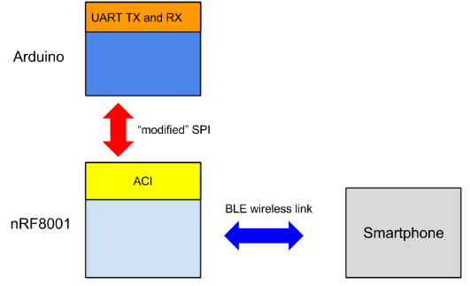
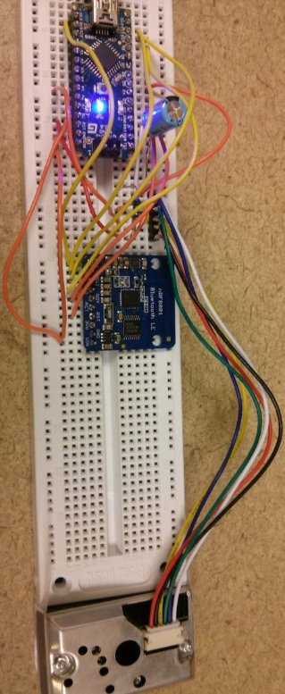
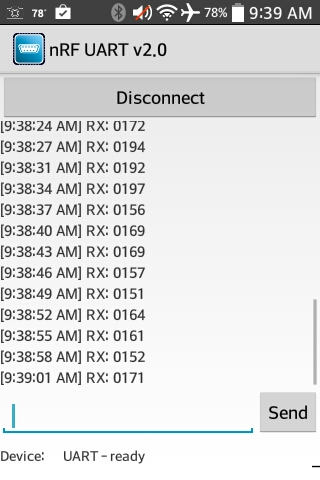

_First created: Jul, 2014 // Last updated: Jul, 2014_

_**Update**: A self-made dust sensor of mine is documented [here](./misc-dust-detector-diy.html), as an alternative to the Sharp dust sensor below._

This article is a follow-up of a [previous post](./misc-dust-detector-with-arduino-serial-comm.html) on making a Sharp dust detector work with Arduino. Here I add a  [Bluetooth Low Energy](http://en.wikipedia.org/wiki/Bluetooth_low_energy) (BLE) interface so that I can use a smartphone to access the dust detector output rather than an Arduino serial console. 

Parts needed: 

* All three parts in the [previous post](./misc-dust-detector-with-arduino-serial-comm.html) are needed. 
* A breakout board for [Nordic nRF8001](http://www.nordicsemi.com/eng/Products/Bluetooth-R-low-energy/nRF8001), available from [Adafruit](http://www.adafruit.com/products/885). 
* [Adafruit's nRF8001 library](https://github.com/adafruit/Adafruit_nRF8001).

## BLE, nRF8001 and Arduino

Bluetooth 4.0, also known as Bluetooth Low Energy (BLE) or Bluetooth Smart, is gaining lots of attentions recently. It is marketed as a very low-power protocol that is designed for low-power devices (e.g., sensors) that can function months or even years merely with a cell battery. Explaining this technology is not the main topic here. However, I do find Heydon's [Bluetooth Low Energy: The Developer's Handbook](http://www.amazon.com/Bluetooth-Low-Energy-Developers-Handbook/dp/013288836X) to be a fantastic reference (__I highly recommend this book for all levels of developers__). And [Getting Started with Bluetooth Low Energy: Tools and Techniques for Low-Power Networking](http://www.amazon.com/Getting-Started-Bluetooth-Low-Energy/dp/1491949511) also has some good examples of practical development for beginners. 

Nordic's nRF8001 is an IC with BLE stack programmed inside, and needs a microcontroller to work together. It uses a propietary but also well documented application controller interface (ACI) to interact with a microcontroller (which is Arduino in this case) through a modified SPI link. The nRF8001 breakout board used here is mostly built around the Nordic's nRF8001 reference design (see Figure 21 in its [datasheet](http://www.nordicsemi.com/eng/content/download/2981/38488/file/nRF8001_PS_v1.2.pdf)) plus a logic level shifter (HJ4050 from TI) on the SPI pins (SCK, REQN, MOSI, MISO, RDYN). That is because the logic high is 3.3V for nRF8001 but 5V for Arduino. More information about nRF8001 is available in its [datasheet](http://www.nordicsemi.com/eng/content/download/2981/38488/file/nRF8001_PS_v1.2.pdf).

I draw a block diagram as shown in Figure 1 to help understand how nRF8001, Arduino and smartphone work together. 

_Figure 1: nRF8001-Arduino-smartphone system block diagram_

In plain English, nRF8001 is the hub where Arduino and smartphone exchanges information. In BLE speak, the smartphone client will be notified once the TX characteristics get updated on the nRF8001 server (new data from Arduino via ACI), and the data will be pushed from nRF8001 to smartphone. In the other direction, smartphone can also send data to nRF8001 (updating the RX characteristics), and nRF8001 notifies and sends the data to Arduino. 

## Implementation

Figure 2 shows the circuit wiring. The part related to the dust detector is the same to the [previous post](./misc-dust-detector-with-arduino-serial-comm.html). What is new are the pins connected to the nRF8001 breakout board as follows: 

* SCK (clock) on nRF8001 board --> Arduino digital pin 13
* MISO (master-in slave-out) on nRF8001 board --> Arduino digital pin 12
* MOSI (master-out slave-in) on nRF8001 board --> Arduino digital pin 11
* REQ (chip-select) on nRF8001 board --> Arduino digital pin 10
* RDY (nRF8001 ready) on nRF8001 board --> Arduino digital pin 2 (should be an interrupt pin)
* RST (reset) on on nRF8001 board --> Arduino digital pin 4
* GND on nRF8001 board --> Arduino GND
* VIN on nRF8001 board --> Arduino 5V VCC
 

_Figure 2: Circuit wiring_

Part of the heavy lifting in software has been done by the friends from Adafruit as they publish Adafruit-flavored nRF8001 Arduino SDK on Github [here](https://github.com/adafruit/Adafruit_nRF8001), which, I believe, is based on [Nordic's BLE SDK for Arduino](https://github.com/NordicSemiconductor/ble-sdk-arduino). Download the SDK, and install it as part of Arduino library by following [this instruction](https://learn.adafruit.com/adafruit-all-about-arduino-libraries-install-use?view=all).

A great part of the code below is derived from the [echoDemo example](https://github.com/adafruit/Adafruit_nRF8001/tree/master/examples/echoDemo). It pushes what is read from the amplifier output to nRF8001. Note that the code works for [Arduino Nano](http://arduino.cc/en/Main/arduinoBoardNano) and Uno. It may need slight change for other Arduino flavors. The code below is released under [MIT license](http://en.wikipedia.org/wiki/MIT_License). Giving credits by linking this post in your work is very much appreciated but not required. 


#include <SPI.h>
#include "Adafruit_BLE_UART.h"

// Hardware SPI pin configuration
// e.g. On UNO & compatible (including Nano): CLK = 13, MISO = 12, MOSI = 11
#define ADAFRUITBLE_REQ 10
#define ADAFRUITBLE_RDY 2     // This should be an interrupt pin, on Uno thats #2 or #3
#define ADAFRUITBLE_RST 4
#define DUSTREAD 5   // analog read pin
#define LEDPOWER 5  // can be any digital pin on the arduino connected to Pin 3 from the sensor

Adafruit_BLE_UART BTLEserial = Adafruit_BLE_UART(ADAFRUITBLE_REQ, ADAFRUITBLE_RDY, ADAFRUITBLE_RST);

// Pulse excitation timing
int delayTime=280;
int delayTime2=40;
int offTime=9680;

// This function returns what is read from DUSTREAD analog pin
int dust_read() {
  int dustVal; 
  digitalWrite(LEDPOWER,LOW); // power on the LED
  delayMicroseconds(delayTime);
  dustVal=analogRead(DUSTREAD); // read the dust value via pin 5 on the sensor
  delayMicroseconds(delayTime2);
  digitalWrite(LEDPOWER,HIGH); // turn the LED off
  delayMicroseconds(offTime);
  return dustVal; 
}

// Configure the Arduino and start advertising with the radio
void setup(void)
{ 
  pinMode(LEDPOWER, OUTPUT);
  
  Serial.begin(9600);
  while(!Serial); // Leonardo/Micro should wait for serial init
  Serial.println(F("Adafruit Bluefruit Low Energy nRF8001"));
  BTLEserial.begin();
}

// Constantly checks for new events on the nRF8001
aci_evt_opcode_t laststatus = ACI_EVT_DISCONNECTED;

void loop()
{
  // Tell the nRF8001 to do whatever it should be 
  // working on based on the ACI message
  BTLEserial.pollACI();

  // Ask what is our current status
  aci_evt_opcode_t status = BTLEserial.getState();
  // If the status changed....
  if (status != laststatus) {
    // print it out!
    if (status == ACI_EVT_DEVICE_STARTED) {
      Serial.println(F("* Advertising started"));
    }
    if (status == ACI_EVT_CONNECTED) {
      Serial.println(F("* Connected!"));
    }
    if (status == ACI_EVT_DISCONNECTED) {
      Serial.println(F("* Disconnected or advertising timed out"));
    }
    // OK set the last status change to this one
    laststatus = status;
  }

  if (status == ACI_EVT_CONNECTED) {
    // If there's any data for us...
    if (BTLEserial.available()) {
      Serial.print("* "); 
      Serial.print(BTLEserial.available()); 
      Serial.println(F(" bytes available from BTLE"));
    }

    // OK while we still have something to read, get a character and 
    // print it out. The incoming message can be potentially used to 
    // trigger certain behavior (not implemented here). 
    while (BTLEserial.available()) {
      char c = BTLEserial.read();
      Serial.print(c);
    }
    
    // Always push data to nRF8001 server once the read value from 
    // DUSTREAD pin is available
    int data = dust_read();
    
    // Note that data is an integer between 0 and 1023
    // To transmit in ASCII string, need to get the digits on each 
    // decimal place
    uint8_t dd[4]; 
    dd[3] = data/1000; 
    dd[2] = (data - dd[3]*1000)/100; 
    dd[1] = (data - dd[3]*1000 - dd[2]*100)/10;
    dd[0] = data - dd[3]*1000 - dd[2]*100 - dd[1]*10; 
    
    uint8_t sendbuffer[5];
    // Now convert int to ASCII
    for(int ii=0; ii<4; ii++) {  
      sendbuffer[ii] = dd[3-ii] + '0';
    }
    sendbuffer[4]='\0';

    Serial.print(F("\n* Sending -> \"")); 
    Serial.print((char *)sendbuffer); 
    Serial.println("\"");

    // write the data to nRF8001, to be sent to smartphone
    BTLEserial.write(sendbuffer, 4);
    delay(3000);
  }
}
 

## Testing

One needs a BLE client on smartphone to test the functionality of the circuit. First check your if your smartphone has BLE capability. Download an app named "nRF UART" from [Google Play](https://play.google.com/store/apps/details?id=com.nordicsemi.nrfUARTv2&hl=en) or [App Store](https://itunes.apple.com/us/app/nrf-uart/id614594903).

Open the app, click "Connect". One should see the RX values being pushed to the smartphone once get connected. One should get something like in Figure 3: 

## Reference

* [Adafruit's tutorial on nRF8001 breakout board](https://learn.adafruit.com/getting-started-with-the-nrf8001-bluefruit-le-breakout?view=all)
