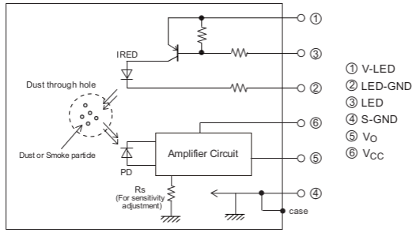
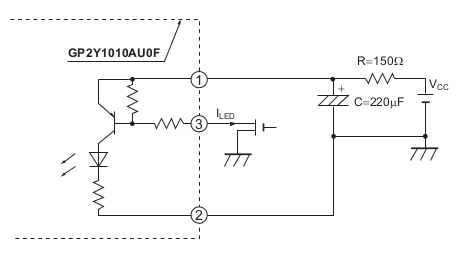
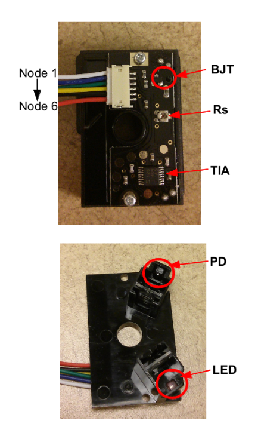
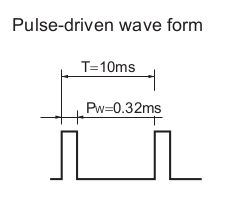
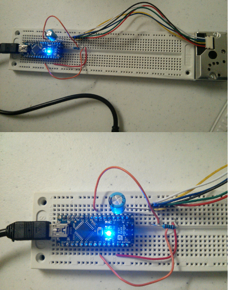
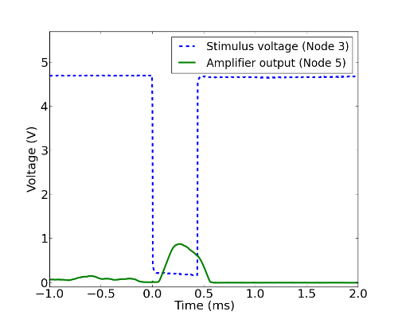

_First created: Jun, 2014 // Last updated: Jul, 2014_

_**Update**: a new post on using the Sharp dust detector with BLE is available [here](./misc-dust-detector-with-arduino-ble.html)._
_**Update**: A self-made dust sensor of mine is documented [here](./misc-dust-detector-diy.html), as an alternative to the Sharp dust sensor below._

This article documents how to make a Sharp dust detector work with Arduino. The data related to dust density can be read from an Arduino serial console. 

Parts needed: 

* Sharp dust detector (part no. GP2Y1010AU0F): It is available in various sources such as [SparkFun](https://www.sparkfun.com/products/9689), [eBay](http://www.ebay.com/sch/i.html?_trksid=p2050601.m570.l1313.TR0.TRC0.H0.XGP2Y1010AU0F&_nkw=GP2Y1010AU0F&_sacat=0&_from=R40), or [AliExpress](http://www.aliexpress.com/wholesale?SearchText=GP2Y1010AU0F&catId=&iniamplifiertive_id=SB_20140720161522). Its datasheet is [here](./assets/files/wiki/sharp_dust_detector_gp2y1010au_datasheet.pdf), and its application note is [here](./assets/files/wiki/sharp_dust_detector_gp2y1010au_datasheet.pdf). 
* A mating connector with cable to the Sharp dust detector above. It is either available as a [separate part on Sparkfun](https://www.sparkfun.com/products/9690), or very probably comes as part of the bundle if you get the dust from eBay or AliExpress. 
* An Arduino or its compatible clone. I use an [Arduino Nano](http://arduino.cc/en/Main/arduinoBoardNano) here. 

## Working Principle

The datasheet has a simple circuit diagram below (Figure 1) that explains the working principle quite well. 

_Figure 1: Dust detector circuit diagram._

This sharp dust detector senses the dust optically. First, the infrared LED shines the test space with an infrared light pulse. The photodiode (PD) collects the scattered light by the dust, and converts the light into photocurrent which is further amplified by the transimpedance amplifier. The output voltage from the amplifier is positively correlated with the scattered light, thus the dust density in the test space. The resistor Rs is probably the feedback resistor determining the sensitivity of amplifier. 

After a brief test, the resistor between BJT base and Node 1 is 270 Ohm, the resistor between BJT base and Node 3 is 4.7 kOhm, the resistor between LED cathode and Node 2 is less than 4 Ohm. Node 3 controls the LED current flow: when Node 3 is low (0V), the BJT is turned on, and LED is lit; when Node 3 is high, the BJT is off, and the LED is also off. 

There is extra subtlety about the shunt capacitor between the Node 1 and the ground, as indicated by the figure from the datasheet (Figure 2): 
 

_Figure 2: The capacitor is needed to make the whole thing work. Similar idea can be seen in some other circuit such [a short pulse generator using an avalanche transistor](http://www.kerrywong.com/2013/05/18/avalanche-pulse-generator-build-using-2n3904/)._

The capacitor is very important here because it provides a large discharging current to the LED when the BJT is turned on, since the on-resistance of the emitter and collector of the BJT is very small compared with 150 Ohm. The discharging RC time is determined by the capacitor and the resistor between LED cathode and Node 2 (GND) which is less than 1 ms. As the BJT is turned off, the big RC (150 Ohm and 220 uF) network near Vcc charges the capacitor slowly (RC time ~ 33ms), getting ready for the next discharge. The corresponding charging current of the capacitor is 

$$ I_{charging} = \frac{V_0}{R} \exp{\left[-\frac{t}{RC}\right]} $$

where R=150 Ohm and C=220 uF, V0 is the Vcc voltage (5V). Note that at t=0 (the moment BJT is turned off), the charging current is V0/R. Therefore larger R yields smaller peak current (which is good if this thing is power by a battery), but longer charging time. 

However, it is still not clear to me the use of the resistor between Node 1 and 3. Maybe other people can shine some light. 

Figure 3 shows the front and back side of the dust detector after a teardown. On the front side, one can see a BJT near the top, and another IC below which is probably the amplifier. On the back side, the LED and PD are in the two corners. There seems to be lens in the LED and PD packages for focusing purpose. Also the dark color of the PD indicates it is solar-blind, meaning there is a filter removing most of the visible light so that it is less vulerable to the ambient light inference. 

_Figure 3: The front and back sides of the Sharp dust detector._

## Circuit Implementation

From the datasheet, the stimulus voltage timing (at Node 3) is as follows (Figure 4): 

_Figure 4: Dust detector stimulus voltage timing._

And the voltage output should be read 0.28 ms after the rising edge of the stimilus voltage. 

In my implementation, the six nodes in the above circuit diagram are connected as follows: 

* Node 1: "Vcc" after the RC network in Figure 2
* Node 2: GND
* Node 3: a digital IO pin (digital pin #5 in Arduino)
* Node 4: GND
* Node 5: ADC pin (analog pin #5 in Arduino)
* Node 6: 5V (Vcc)

The Arduino source code is as follows:


int dustPin=5;
int dustVal=0;

int ledPower=5; // ledPower is any digital pin on the arduino connected to Pin 3 from the sensor
int delayTime=280;
int delayTime2=40;
int offTime=9680;

void setup(){
Serial.begin(9600);
pinMode(ledPower,OUTPUT);
}

void loop(){
digitalWrite(ledPower,LOW); // power on the LED
delayMicroseconds(delayTime);
dustVal=analogRead(dustPin); // read the dust value via pin 5 on the sensor
delayMicroseconds(delayTime2);
digitalWrite(ledPower,HIGH); // turn the LED off
delayMicroseconds(offTime);

delay(3000);
Serial.println(dustVal);
}


The ADC of Arduino is 10 bit reference to 5V. The read will be between 0 and 1023, with each unit equivalent to 4.9 mV (see [this reference](http://arduino.cc/en/Reference/analogRead)). The ADC read can be reflected in the Arduino serial communication console. 

The circuit wiring is shown in the Figure 5: 

_Figure 5: Dust detector circuit wiring._

## Testing

I find a burning [incense](http://en.wikipedia.org/wiki/Incense) stick can be a good dust source for quanlitative testing of this circuit. Incense sticks can be purchased in some Asian grocery stores. 

In a clean air condition, the ADC mostly reads between 120 and 160 (a large variation). This is probably the background signal plus the voltage offset from the amplifier itself. When the device is exposed to a burning incense stick, the number shoots off and saturates at 750 (equivalent to 3.66V). So this circuit works. However, the quantative relationship between the dust density and output voltage needs more comprehensive test with calibrated dust source. 

I also use an oscilloscope to measure the amplifier response upon the pulse excitation of Node 3 in clear air condition, which is plotted in Figure 6. The raw data and the plotting script (written in Python) are available [here](https://gist.github.com/lijunhw/c97857a7beebe0a154f0). One can see the amplifier output increases as the voltage on Node 3 goes to digital low, and the rise time is what is expected (RC time constant less than 1 ms, explained in the first section "Working Principles"). 

_Figure 6: Dust detector pulse response in a clean air environment._

One problem about this circuit is it draws lots of current, about 90 mA tested by my current meter. I think it has something to do with the shunt resistor between the base and Node 1 of the BJT in Figure 1. A redesign of the LED driving circuit can solve this problem. 

## Reference

* Sharp GP2Y1010AU0F [datasheet](./assets/files/wiki/sharp_dust_detector_gp2y1010au_datasheet.pdf) and [application notes](./assets/files/wiki/sharp_dust_detector_gp2y1010au_datasheet.pdf).
