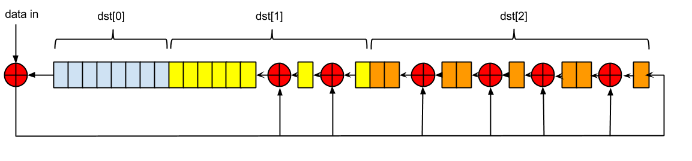

_First created: Aug, 2014 // Last updated: Aug, 2014_

This project is inspired by Dmitry Grinberg's idea ["Bit-banging Bluetooth Low Energy"](http://dmitry.gr/index.php?r=05.Projects&proj=11.%20Bluetooth%20LE%20fakery), which is hacking an nRF24L01+ module (which is under $1 per unit on eBay) as a low-cost Bluetooth Low Energy (BLE) advertizer. This can be used in various applications, such as sending small amount of insensitive data from a sensor to a smartphone, or things similar to iBeacon. Dmitry demonstrated the idea with a [Nordic key fob](https://www.sparkfun.com/products/retired/8602) which was retired by SparkFun, and the code was written for ATtiny24 microcontroller. What I intend to do here is to implement it on Arduino instead, layering the ground for other general purpose applications on Arduino. I also try to document the whole thing with more details. Luckily, it is not very hard after some research. 

Parts needed: 

* nRF24L01+ module, available from various source such as [eBay]((http://www.ebay.com/sch/i.html?_from=R40&_trksid=p2050601.m570.l1311.R1.TR11.TRC1.A0.H0.Xnrf24L.TRS0&_nkw=nrf24l01&_sacat=0)), AliExpress, SparkFun, etc.
* Arduino (I use Arduino Nano, but other flavors also work)
* Wires (to be soldered to nRF24 module)
* A smartphone with BLE capability
* [My source code](https://github.com/lijunhw/nRF24_BLE/blob/master/Arduino/nRF24_BLE_advertizer_demo/nRF24_BLE_advertizer_demo.ino)

## Principles

As Dmitry explained in [his post](http://dmitry.gr/index.php?r=05.Projects&proj=11.%20Bluetooth%20LE%20fakery), a "fake" BLE connection cannot be established between an nRF24 module (peripheral) and a BLE central device because of its hardware limitation. But BLE broadcasting from a nRF24 module is possible. 

To understand how to fake BLE broadcasting with nRF24L01+, a comparison between the packet structure of BLE (Figure 1) and nRF24 (Figure 2) can be very helpful. 

_Figure 1: Advertizing packet structure of BLE._

BLE advertizing packet is made up of three sections: 

* 1 byte of preamble (either 01010101 or 10101010, depending on the first bit of the access address).
* 4 byte of access address, which is always 0x8E89BED6 for advertizing packets.
* Variable size of payload, which is made up of the following: 
  * The first byte of payload is header, specifying the advertizing type, as well as TX and RX types;
  * The second byte is the length of the rest of the payload __excluding__ CRC bytes. 
  * The last three bytes are 24-bit CRC checksum of the payload before it. 
  * Everything in the middle is the data section, which is made up data "containers". In each data container, the first byte is the length of the rest bytes in the data container (excluding the length byte itself), and the rest bytes are data. Data whitening is also imposed on the payload. 

_Figure 2: nRF24 ShockBust(TM) packet structure. Note that there is no whitening as in BLE._

The nRF24L01+ actually has two different types of packet structures: ShockBurst and Enhanced ShockBurst. We want to use the old ShockBurst format, because the 9-bit packet control section between access address and payload in the Enhanced ShockBurst format makes it impossible for BLE fakery. From Figure 2, the packet format is similar to BLE, except that nRF24L01+ has 16-bit CRC rather than 24-bit, and there is no whitening. The way around is that we disable CRC on nRF24L01+ and compute it on our own; data whitening must be implemented in software as well. Also, _for each packet section_, nRF24L01+ transmits the most significant byte first, and also transmits the most significant bit first in each byte. This is just the opposite of BLE which transmits the least significant byte first with least significant bit first in each byte. So bit order reversal is required for access address and payload sections (preamble is automatically assembled based on the first bit in the access address). 

The CRC-24 of BLE is implemented with linear feedback shift registers (LFSR) in hardware (Figure 3), which is the "btLeCrc()" function in the code (see the next section). It is a basic bit-by-bit manipulation (exclusive-or) to implement the modulo 2 division of 24-bit polynomials. Details of CRC can be found in the reference near the end of this article. 

_Figure 3: LFSR implementation of CRC-24 in BLE. The "dst" corresponds to the CRC buffer with the same name in the source code in the next section._

On the nRF24L01+ side, the pinout of the module is in Figure 4. It is relatively easy to operate with nRF24L01+ since both data transfer and configuration is carried out via SPI interface, by reading from and writing to the registers in nRF24L01+. Detailed information on how to use nRF24L01+ can be found in [its datasheet](./assets/files/wiki/nRF24L01plus_datasheet.pdf). You are encouraged to go through the datasheet since it is not very long (less than 100 pages) and has everything you need to know. 

_Figure 4: nRF24L01+ module pinout._ 

## Implementation

You probably get nRF24L01+ modules with 4-by-2 headers, which cannot be directly mounted onto a breadboard. Here I solder a few wires to those headers to interface with a breadboard. The circuit is wired on breadboard as in Figure 5: 

_Figure 5: nRF24L01+ BLE broadcaster breadboarding._ 

The Arduino demo code can be found in my github repo [here](https://github.com/lijunhw/nRF24_BLE/blob/master/Arduino/nRF24_BLE_advertizer_demo/nRF24_BLE_advertizer_demo.ino). After borrowing a few key functions from Dmitry's code, it initializes nRF24L01+ with a few register writes, and then broadcasts with a device name "nRF24" and two bytes of custom data 0x0102 (for testing purchase) in BLE's language. You can easily substitute the "0x0102" with other useful data such as an ADC reading from a sensor. Remember change the payload length and data container length accordingly to make the whole thing work. 

After programming the Arduino, a BLE broadcaster named "nRF24" can be seen on my Android smartphone with BLE enabled. To view the custom data, I install the Android app "[nRF Master Control Panel](https://play.google.com/store/apps/details?id=no.nordicsemi.android.mcp&hl=en)", and I do see the "0x0102" custom data (Figure 6). Hooray!

_Figure 6: nRF24L01+ BLE testing. Note that the custom data "0x0102" is recognized._

## Reference

* ["Bit-banging Bluetooth Low Energy"](http://dmitry.gr/index.php?r=05.Projects&proj=11.%20Bluetooth%20LE%20fakery)
* [Bluetooth Low Energy: The Developer's Handbook](http://www.amazon.com/Bluetooth-Low-Energy-Developers-Handbook/dp/013288836X): highly recommended for both beginners and advanced developers.
* [nRF24L01+ datasheet](./assets/files/wiki/nRF24L01plus_datasheet.pdf)
* [A Painless Guide to CRC Error Detection Algorithms](http://www.ross.net/crc/download/crc_v3.txt): a fantastic tutorial on CRC from the ground up; discussing both the basic bit-by-bit implementation and more advanced table-driven method. 
* [This CRC class note](http://www.cs.jhu.edu/~scheideler/courses/600.344_S02/CRC.html) also gives easy-to-follow phenomenal procedure on how CRC works 
* [CRC notes from Hacker's Delight](crc_hackers_delight.pdf): it discusses how to implement CRC in hardware using LFSR
