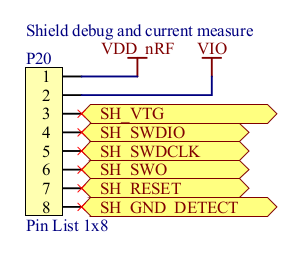

_Created: Mar, 2015_

It turns out the nRF51-DK (which builds around an nRF51422 SoC) board has a JLink debug-out port that can be used to program other nRF51822 and nRF51422 SoCs, or more generally other ARM chips supported by JLink. It is not hard to do and can be handy if you don't have another standalone JLink debugger. 

The ["nRF51-DK Hardware Files 1.1.0"](./assets/files/wiki/nRF51-DK - Hardware files 1_1_0.zip) shows the schematic and layout of the board (PCA10028). Since the 9-pin debug-out port pins (P19) are tiny and may require special cables, it is more convenient to use the shield debug-out (P20). The figure below is taken from the nRF51-DK schematic, showing the pinouts of P20: 

_Figure 1: Pinout of shield debug-out (P20) on nRF51-DK board_

To determine the pin mapping of P20, just use the fact that pin #1 is closer to the USB port than pin #8. 

nRF51 SoCs can be programmed by the SWD interface which JLink supports. If the target board is not powered by default (which is very likely), use the following mapping: 

* SWDIO on nRF51 connects to SH_SWDIO (pin #4) on P20 
* SWDCLK on nRF51 connects to SH_SWDCLK (pin #5) on P20
* VDD on nRF51 connects to SH\_VTG (pin #3) on P20 and VDD (pin #1) of the nRF51-DK board
* GND on nRF51 connects to SH\_GND\_DETECT (pin #8) on P20 and GND of nRF51-DK board

The SH\_VTG is low and SH\_GND\_DETECT is high by default when nothing is connected to P20. That is how JLink chip senses the presence of another nRF51 SoC in debug-out port.
